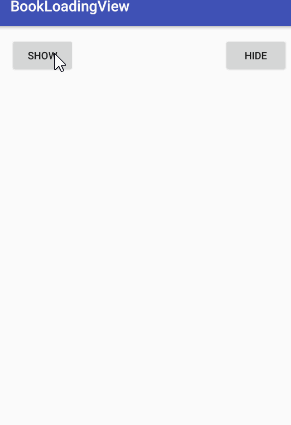

# BookLoadingView
不知道有什么用的加载页面
## 起因 ##
有一天设计拿了一张gif

	

给前端的说实现这么一个加载动画，要求代码实现，不能用gif。前端当时那个一脸不爽的表情我记忆犹新←_←  
由于最近app开发也完成了本人也是比较爱好动画之类的东西，所以我就想实现一个android端的加载图。在经过1个上午与2个下午的时间终于做出来了一个不知道有什么用的加载动画第一版本。文字动画使用的是[JumpingBeans](https://github.com/frakbot/JumpingBeans)

	

## 如何使用 ##
使用起来也是非常的方便快捷  
在xml中：  

    <com.wang.bookloading.widget.BookLoadingView
        android:id="@+id/book_loading_view"
        android:layout_width="wrap_content"
        android:layout_height="wrap_content"
        android:layout_gravity="center"
        app:blv_tickColor="@color/light_green500"
        app:blv_tickStrokeWidth="4dp"
        app:blv_lineColor="@color/grey500"
        app:blv_lineStrokeWidth="8dp">

    </com.wang.bookloading.widget.BookLoadingView>  

java中只要：  

    @OnClick(R.id.show_btn)
    public void onMShowBtnClicked() {
        //start loading
        mBookLoadingView.setVisibility(View.VISIBLE, 0);
    }

    @OnClick(R.id.hide_btn)
    public void onMHideBtnClicked() {
        //stop loading
        mBookLoadingView.setVisibility(View.GONE);
    }

## Styleable ##
<table>
<thead>
<tr>
<th align="center">name</th>
<th align="center">format</th>
<th align="center">description</th>
</tr>
</thead>
<tbody>

<tr>
<td align="left">blv_delay</td>
<td align="center">integer</td>
<td align="center">动画开始的延迟</td>
</tr>

<tr>
<td align="left">blv_firstDuration</td>
<td align="center">integer</td>
<td align="center">path动画的时间</td>
</tr>

<tr>
<td align="left">blv_textDuration</td>
<td align="center">integer</td>
<td align="center">文字动画的时间</td>
</tr>

<tr>
<td align="left">blv_pageDuration</td>
<td align="center">integer</td>
<td align="center">翻页动画的时间</td>
</tr>

<tr>
<td align="left">blv_startColor</td>
<td align="center">color</td>
<td align="center">被翻页面的开始时和结束时的颜色</td>
</tr>

<tr>
<td align="left">blv_endColor</td>
<td align="center">color</td>
<td align="center">被翻页面的中间时的颜色</td>
</tr>

<tr>
<td align="left">blv_tickColor</td>
<td align="center">color</td>
<td align="center">左边√的颜色</td>
</tr>

<tr>
<td align="left">blv_tickStrokeWidth</td>
<td align="center">dimension</td>
<td align="center">左边√的粗细</td>
</tr>

<tr>
<td align="left">blv_lines</td>
<td align="center">float</td>
<td align="center">右边线条书</td>
</tr>

<tr>
<td align="left">blv_lineColor</td>
<td align="center">color</td>
<td align="center">右边线条颜色</td>
</tr>

<tr>
<td align="left">blv_lineStrokeWidth</td>
<td align="center">dimension</td>
<td align="center">右边线条的粗细</td>
</tr>

<tr>
<td align="left">blv_linePadding</td>
<td align="center">dimension</td>
<td align="center">右边线条的间隔大小</td>
</tr>

<tr>
<td align="left">blv_textSize</td>
<td align="center">dimension</td>
<td align="center">底部文字大小</td>
</tr>

<tr>
<td align="left">blv_textColor</td>
<td align="center">color</td>
<td align="center">底部文字颜色</td>
</tr>

<tr>
<td align="left">blv_text</td>
<td align="center">string</td>
<td align="center">底部文字内容</td>
</tr>

</tbody>
</table>

## TODO ##
<ol>
  <li>底部文字动画的修改</li>
  <li>翻页时被翻页面厚度增加</li>
  <li>宽度自定义</li>
</ol>